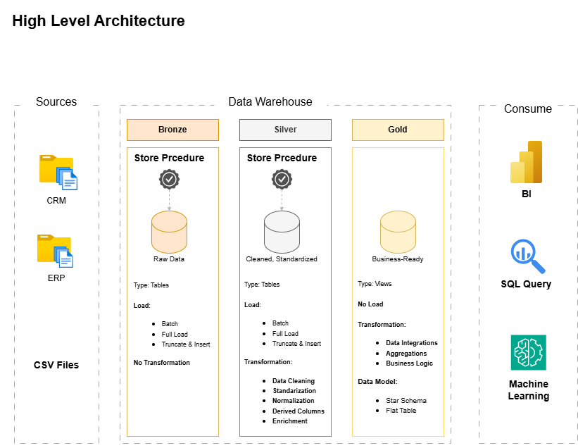
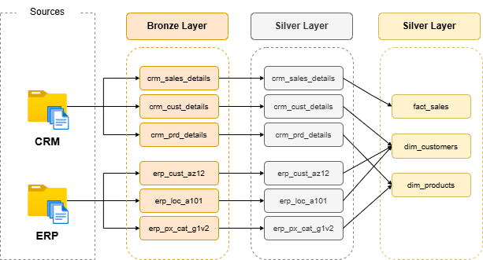
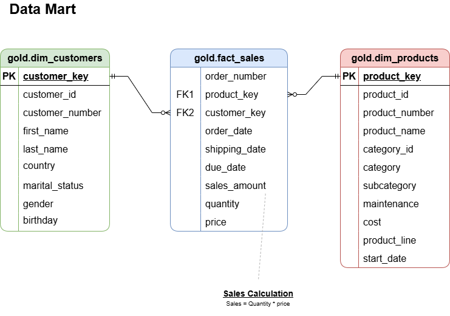

# Data Warehouse and Analytics Project

This project demonstrates a comprehensive data warehousing and analytics solution, spanning the development of a data warehouse to the generation of insights. Designed as a portfolio project, it highlights industry best practices in data engineering and analytics.

## Project Overview

This project involves:
1. **Data Architecture**: Designing a modern data warehouse using Medallion Architecture **Bronze**, **Silver**, and **Gold** layers.
2. **ETL Pipelines**:  Extracting, transforming, and loading data from source systems into the warehouse.
3. **Data Modeling**: Developing fact and dimension tables optimized for analytical queries.
4. **Analytics and Reporting**: Creating SQL-based reports and dashboards for actionable insights.

This repository is my first SQL end-to-end project to showcase exertise in:
* SQL Development
* Data Architect
* Data Engineering
* ETL Pipeline Developer
* Data Modeling
* Data Analytics

---

## Project Requirements

#### Building the Data Warehouse (Data Engineering)

Develop a modern data warehouse using SQL Server to consolidate sales data, enabling analytical reporting and informed decision-making.

* **Data Sources**: Import data from two source systems (ERP and CRM) provided as CSV files.
* **Data Quality**: Cleanse and resolve data quality issues prior to analysis.
* **Integration**: Combine both sources into a single, user-friendly data model designed for analytical queries.
* **Scope**: Focus on the latest dataset only; historization of data is not required.
* **Documentation**: Provide clear documentation of the data model to support both business stakeholders and analytics teams.

---

## Data Architecture

The data architecture for this project follows Medallion Architecture Bronze, Silver, and Gold layers:

1. **Bronze Layer**:
Stores raw data ingested directly from source systems without transformation. Data is loaded from CSV files into a SQL Server database in its original format.

2. **Silver Layer**:
Responsible for data cleansing, standardization, and normalization. This layer refines raw data to ensure consistency, quality, and suitability for downstream processing.

3. **Gold Layer**:
Contains business-ready, curated datasets modelled using a star schema. This layer is optimized for reporting, analytics, and consumption by BI tools.

---

## Data Flow

---

## Data Mart

---

## Important Links:

This project is based on and adapted from the work of **DataWithBaraa**.  
Special thanks to the following original sources:

- GitHub Repository by DataWithBaraa:
  https://github.com/DataWithBaraa/sql-data-warehouse-project

- YouTube Tutorial by DataWithBaraa:
  https://www.youtube.com/@DataWithBaraa

All credit for the foundational architecture and concepts goes to the original author.

